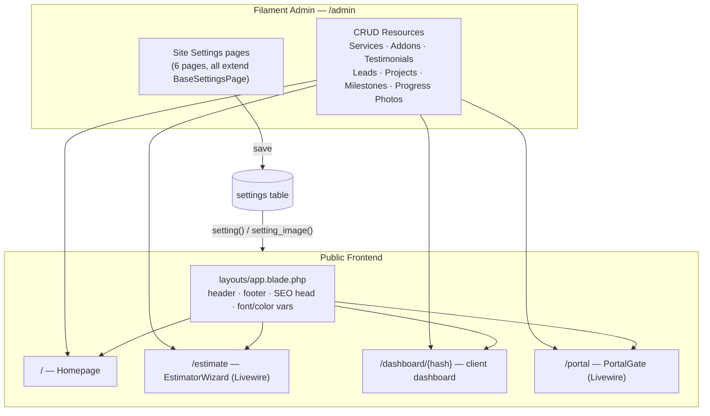
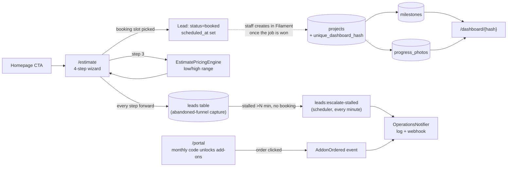

# Texas Lawn Legends

A "Systematizing Growth" digital platform for a premium Dallas landscaping company: a fully CMS-editable marketing site, an interactive lead-qualification estimator, a private client project dashboard, and a monthly-gated member portal — all on top of a locked-down Filament admin panel.

**Stack:** Laravel 13 · Filament v4 · Livewire 3 · Tailwind CSS v4 (CSS-first) · Alpine.js (via Livewire) · SQLite (dev)

---

## Why everything is editable

Nearly every piece of copy, imagery, and pricing math on this site reads from one table — `settings` (key/value pairs, typed as string/text/integer/decimal/boolean/json). Two global helpers resolve them anywhere in PHP or Blade:

```php
setting('hero_heading');              // -> "Transform Your Dallas Yard Into An Outdoor Retreat."
setting_image('logo_image');          // -> public storage URL, or null if unset
```

Six dedicated Filament pages under **Site Settings** edit these keys through real forms (uploads, color pickers, repeaters, key/value editors) instead of raw key/value rows:

| Page | Controls |
|---|---|
| **Branding & Theme** | Logo image/wordmark, favicon, brand font (Bunny CDN for non-default fonts), brand colors (remap the Tailwind shades the design uses) |
| **SEO & Analytics** | Meta title/description/keywords, OG share image, GA4/GTM IDs, search-indexing toggle |
| **Contact & Footer** | Business name/phone/email/address, service-area tags, footer copy |
| **Homepage Content** | Every hero/trust-bar/process-step/heading/CTA field (repeaters for steps + badges) |
| **Estimator & Pricing** | Base rate/sqft, neighborhood + complexity multipliers, sqft bounds, custom-project threshold, booking days/time slots |
| **Operations Alerts** | Webhook URL, alert email, lead-escalation threshold (minutes) |

A generic **Settings** CRUD resource (under Configuration) is the escape hatch for editing any raw key that doesn't have a dedicated page yet.

---

## System map



## Customer journey → where data lands



## Component-by-component

### 1. Content & theming
`app/helpers.php` (autoloaded via composer `files`) exposes `setting()`/`setting_image()`. `App\Models\Setting::get()`/`set()` cache each key individually (not the model instance — caching Eloquent models broke unserialization across requests, fixed early on). Branding settings inject CSS variables straight into `<head>` in `resources/views/layouts/app.blade.php`, so color-picker and font changes take effect site-wide without a rebuild.

### 2. Homepage (`/`)
`HomeController` → `resources/views/home.blade.php`. Services split into Create/Care suites via the `ServiceCategory` enum; testimonials feed the neighborhood-proof tabs (Alpine `:class` toggle, **not** `x-show` + `x-transition` — that combination silently failed to react in this Alpine build). All copy/images pulled from Homepage Content settings.

### 3. Estimator (`/estimate`)
`App\Livewire\EstimatorWizard` — a 4-step component (contact+neighborhood → service scope → sqft/complexity slider → value gate/booking).

- **Abandoned-lead capture**: `persistLead()` runs on every `nextStep()`, upserting the `leads` row so even a step-1 dropout is captured (`status=partial`).
- **Pricing**: `App\Services\EstimatePricingEngine::calculate()` —
  `low = price_per_sqft_modifier × service.base_price_multiplier × sqft × neighborhood_modifier × complexity_modifier`, `high = low × estimate_high_multiplier`. Flags `is_custom` when the high estimate exceeds `estimate_custom_threshold` or sqft hits the max — swaps in the "this project is unique" consultation path instead of a price.
- **Booking**: `App\Services\BookingMatrix::slots()` builds the next N business days × configured time slots; booking sets `status=booked` + `scheduled_at`.

### 4. Client dashboard (`/dashboard/{hash}`)
`App\Http\Controllers\DashboardController@show`, route-model-bound on `Project.unique_dashboard_hash` (an unknown hash 404s automatically — the hash *is* the auth, no login required). Staff create the `Project` in Filament once a lead becomes a real job (it auto-generates the hash; `lead_id` optionally links it back). Progress photos are grouped by `milestone_step` so each timeline card only shows its own proof-of-work images.

### 5. Member portal (`/portal`)
`App\Livewire\PortalGate`, dual-state:

- **Locked**: token input → `App\Services\MonthlyCodeAuthenticator::attempt()`, which requires the code to be `is_active` **and** have `target_month` equal to the current `Y-m` — access expires every month automatically, no cron needed for that part. A valid unlock increments `usage_count` and writes a protected session variable (survives reload).
- **Unlocked**: available add-ons grid; ordering dispatches `App\Events\AddonOrdered`.

### 6. Operations alerting
`App\Services\OperationsNotifier::dispatch()` is the single alerting surface — always logs, and POSTs to `operations_webhook_url` if one is configured. Two triggers feed it:

- **Event-driven**: `AddonOrdered` → auto-discovered listener `NotifyOperationsOfAddonOrder` (portal orders).
- **Time-driven**: `leads:escalate-stalled` (`App\Console\Commands\EscalateStalledLeads`), registered in `routes/console.php` via `Schedule::command(...)->everyMinute()`. Deliberately a **scheduled poll**, not a delayed queue job — cPanel shared hosting has no persistent queue-worker daemon, but runs Laravel's scheduler fine off a single cron line. It finds leads that are `qualified`, have no `scheduled_at`, and have sat past `lead_escalation_minutes` since their last update, alerts on each, then marks `leads.escalated_at` (via `saveQuietly()`) so it never double-fires.

### 7. SEO
`resources/views/partials/seo.blade.php` builds title/description/canonical/robots/OG/Twitter/favicon/JSON-LD (`LandscapingBusiness` schema, `areaServed` from the service-area tags) from settings, included on every page via the layout. Private pages (`dashboard`, `portal`) pass `$noindex = true`. `/sitemap.xml` and `/robots.txt` are real routes (`routes/web.php`), not static files — the default static `public/robots.txt` was removed so the dynamic route takes over.

---

## Data model

9 tables: `settings`, `services`, `leads`, `projects`, `milestones`, `progress_photos`, `addons`, `access_codes`, `testimonials`. Enums (`App\Enums`): `ServiceCategory` (create/care), `LeadStatus` (partial/qualified/booked/lost), `ProjectStatus` (scheduled/active/completed), `MilestoneStatus` (pending/in_progress/completed) — all implement Filament's `HasLabel`/`HasColor` for admin display.

Key relationships: `Lead hasOne Project` · `Project hasMany Milestone, ProgressPhoto` · `Milestone/ProgressPhoto belongsTo Project`.

---

## Local development

```bash
composer install
npm install
cp .env.example .env && php artisan key:generate
php artisan migrate --seed
php artisan storage:link
npm run build          # or `npm run dev` while iterating on frontend
php artisan serve
```

Seeded admin login: `admin@admin.com` / `pass` at `/admin`.

Seeded member-portal codes (current month only — regenerate via `AccessCodesSeeder` if testing in a later month): `LEGENDS-<ymd>`, `MEMBER-<MON>`.

### Industry packs (`APP_NICHE`)

One install = one industry. Set in `.env`:

```bash
APP_NICHE=lawn
APP_DEMO_HUB=true
```

**Packs shipping today**

| Pack | Brand (demo) | Switch |
|---|---|---|
| `lawn` | Texas Lawn Legends | richest demo |
| `cleaning` | BrightSide Cleaning | thin showcase |
| `roofing` | Summit Roof Co | thin showcase |

**How to pitch (60–90 seconds)**

1. Open `/demo` (requires `APP_DEMO_HUB=true` or local env)
2. Click an industry card → site reloads as that model home
3. Walk hero → `/estimate` → admin edit a page
4. After the call: Admin → **Site Settings → Industry Packs** → **Reset current pack**

Or from CLI: `php artisan niche:load cleaning` / `php artisan niche:load --reset`

Product Parts (Website / Booking / Ops) still control *which features* are on; packs control *industry words and starter content*.

---

## What's built vs. what's left

**Done:** database + models + Filament CRUD (9 resources), full CMS-editable settings (6 pages), SEO, homepage, estimator + pricing engine, client dashboard, member portal + monthly auth, operations alerting (event- and time-driven).

**Deferred until an actual client/hosting environment is in hand:** Section V of the original spec — cPanel/Vite production deployment (build-output routing to `public_html`, the symlink strategy for Laravel's folder layout on shared hosting, `.env` hardening, and wiring the one cron line the scheduler needs).
